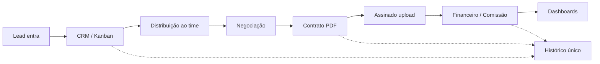

# Roteiro da Call — Apresentação + Roadmap

**Duração sugerida:** 35–45 min  
**Quem:** você (comercial / produto) + colega dev (confiança técnica)  
**Objetivo da call:** alinhamento de dor → visão da solução → roadmap claro → preço → próximo passo (sim / ajustes / data de kickoff)

---

## Divisão de papéis (combinem antes)

| Papel                            | Você  | Colega Dev                           |
| -------------------------------- | ----- | ------------------------------------ |
| Abertura e condução              | ✅    |                                      |
| Problema / contexto do cliente   | ✅    | reforça com perguntas                |
| Visão do produto (o que resolve) | ✅    |                                      |
| Demo / telas / fluxo técnico     | apoio | ✅ protagonista                      |
| Roadmap e o que entra na V1      | ✅    | confirma viabilidade                 |
| Prazo e marcos                   | ✅    | confirma “é realista”                |
| Preço e pagamento                | ✅    | fica em silêncio (não negociar tech) |
| Objeções técnicas                |       | ✅                                   |
| Fechamento / próximos passos     | ✅    |                                      |

**Regra de ouro:** o cliente fala pelo menos 40% do tempo no começo. Vocês apresentam depois de validar a dor.

---

## Agenda da call (slide a slide / bloco a bloco)

### 0. Abertura — 2 min

- “Obrigado pelo tempo. Hoje queremos alinhar o problema, mostrar como a plataforma resolve o dia a dia de vocês, o roadmap da V1 e os números — e sair com um próximo passo claro.”
- Apresentem os dois em 15s cada (nome + função).

### 1. Confirmar o problema — 5–7 min _(perguntem, não monologuem)_

Perguntas-guia:

1. Como um lead entra hoje e até onde ele vai (comercial → jurídico → pagamento)?
2. Onde mais se perde informação ou retrabalho?
3. O que vocês mais querem ver no primeiro mês de uso?
4. Perspectiva de crescimento nos proximos anos

**Frase de transição:**  
“Pelo que vocês descreveram, o problema não é falta de ferramenta — é operação espalhada. A V1 resolve exatamente esse miolo.”

### 2. Visão em uma frase — 1 min

> Um sistema só: **lead → pipeline → contrato → financeiro → indicadores**, com permissões para o time.

Desenhe (ou mostre) o fluxo:

```text
Captação → Lead no CRM → Kanban → Contrato/PDF → Assinatura (upload) → Pagamento/Comissão → Dashboard
                                              ↓
                                         Jurídico acompanha
                                         o mesmo histórico
```

### 3. O que a V1 entrega (escopo) — 8–10 min

Mostrem **por jornada do usuário**, não lista de features.

**Bloco A — Comercial**

- Cadastro / importação de leads
- Kanban + tabela
- Distribuição (manual, round robin, equipe)
- Histórico completo do lead (nada some)

**Bloco B — Contratos / Jurídico**

- Modelo de contrato → gera PDF a partir do lead
- Status: rascunho → enviado → assinado → arquivado
- Assinatura na V1 = upload do documento assinado (simples e funcional)

**Bloco C — Financeiro + gestão**

- Pagamentos / pendências
- Comissões
- Dashboard comercial e administrativo
- Usuários e permissões (cada um vê o que precisa)

**Bloco D — Explicitamente fora da V1** _(importante para confiança)_

- WhatsApp integrado
- Assinatura eletrônica automática
- Automações avançadas
- IA

“Isso entra depois, com proposta própria — não inflamos a V1.”

> **Dev:** aqui mostra 1–2 telas (login, kanban ou detalhe do lead) se tiverem protótipo/Stitch. 2 minutos no máximo. Evitem tour de 15 min.

### 4. Roadmap — 5 min _(a parte que mais tranquiliza)_

Ver seção completa abaixo. Falem assim:

1. “V1 = operação rodando (próximas ~10–12 semanas)”
2. “V2 = integrações e produtividade”
3. “V3 = inteligência artificial, quando fizer sentido”

### 5. Como trabalhamos juntos — 3 min

- Kickoff → marcos com demo → homologação de vocês → go-live
- Vocês validam em até 5 dias úteis por marco
- Templates de contrato e regras de comissão vêm de vocês
- Treinamento: 2 sessões remotas com o time

### 6. Investimento — 5 min

Só depois do valor percebido.

|                       | Valor                                                  |
| --------------------- | ------------------------------------------------------ |
| Implantação V1        | **R$ 24.000**                                          |
| Pagamento             | 3 marcos: **R$ 7.200 → R$ 8.400 → R$ 8.400**           |
| Mensalidade (go-live) | **R$ 590/mês** (hosting + suporte + até 4h de ajustes) |

Âncora suave:  
“É na ordem de **~1 a 1,5 mês** do que o comercial já fatura. Se recuperar um negócio que hoje se perde no processo, se paga.”

Se apertar: plano B **R$ 19.900** + **R$ 490/mês** (já combinado entre vocês; não oferecer na abertura).

### 7. Fechamento — 3–5 min

Pergunta direta:

> “Faz sentido seguirmos com a V1 nesse formato? Se sim, o próximo passo é alinhar contrato/kickoff. Se algo estiver fora, a gente ajusta o escopo agora.”

Saídas possíveis:

- **Sim** → data de kickoff + quem assina + o que precisam enviar (modelos, acessos)
- **Quase** → lista objetiva do que mudar (vocês anotam e devolvem proposta em 24–48h)
- **Não agora** → o que falta para decidir? prazo para retorno?

---

## Roadmap para projetar / falar

### Visão geral (slide único)

```text
AGORA                          DEPOIS                         FUTURO
───────────────                ───────────────                ───────────────
V1 — Operação                  V2 — Integrações               V3 — Inteligência
(8–12 semanas)                 (proposta à parte)             (quando houver volume)

• Login e permissões           • WhatsApp                     • Classificação de leads
• Leads + Kanban               • E-mail                       • Apoio a contratos
• Distribuição                 • Assinatura eletrônica        • Sumarização
• Contratos + PDF              • Automações                   • Previsão / recomendações
• Financeiro básico            • Agenda e tarefas
• Dashboards                   • Notificações em tempo real
• Import/export
```

### Roadmap da V1 por fases (o que importa na call)

| Fase                          | Semanas | O que o cliente vê                             | Marco financeiro                  |
| ----------------------------- | ------- | ---------------------------------------------- | --------------------------------- |
| **0. Kickoff**                | 1       | Acessos, usuários, regras, modelos de contrato | **R$ 7.200**                      |
| **1. Fundação**               | 1–2     | Login, usuários, permissões                    | —                                 |
| **2. CRM**                    | 3–4     | Leads, kanban, import, distribuição, timeline  | **R$ 8.400** (ao fechar o núcleo) |
| **3. Contratos + Financeiro** | 2–3     | PDF, status, pagamentos, comissões             | —                                 |
| **4. Dashboards + go-live**   | 1–2     | Indicadores, treino, produção                  | **R$ 8.400**                      |

**Total V1:** ~**8–12 semanas** (depende da velocidade de feedback de vocês).

### O que NÃO prometer na call

- WhatsApp “já na V1”
- Assinatura digital automática
- App mobile nativo
- IA
- Prazo menor que ~8 semanas sem cortar escopo

---

## Roteiro curto se a call for apertada (20 min)

1. Problema (3 min)
2. Fluxo lead → contrato → financeiro (3 min)
3. Incluso / fora da V1 (4 min)
4. Roadmap visual (3 min)
5. Preço + parcelamento (4 min)
6. Próximo passo (3 min)

---

## Frases prontas

**Abertura de valor**  
“Não estamos vendendo um CRM genérico. Estamos montando o sistema operacional do comercial e do jurídico de vocês.”

**Quando pedirem tudo**  
“Dá para fazer. A pergunta é o que precisa estar no ar primeiro para o time trabalhar. Isso é a V1. O resto a gente encaixa sem travar a operação.”

**Quando o jurídico pesar**  
“Na V1 o jurídico já entra no mesmo histórico do lead e no fluxo de contrato/PDF. Assinatura automática e automações ficam na V2 para não atrasar o go-live.”

**Quando perguntarem se já está pronto**  
“Temos base avançada de front e o desenho do produto fechado. A V1 é entrega com marcos — vocês vão vendo e validando, não é caixa-preta no final.”

**Quando o preço apertar**  
“Conseguimos olhar o plano de R$ 19.900 parcelado, mantendo o mesmo núcleo. O que não dá é entregar V1+V2 pelo preço da V1.”

---

## Checklist pré-call (vocês dois)

- [ ] Combinar quem fala o quê (tabela de papéis)
- [ ] Abrir 1–2 telas prontas (kanban / detalhe do lead / login)
- [ ] Ter o fluxo desenhado (miro, figjam ou o mermaid abaixo na tela)
- [ ] Número R$ 24k + R$ 590 na ponta da língua; plano B só se precisar
- [ ] Anotar: quem decide, quem usa, modelos de contrato, data desejada de início
- [ ] Combinar resposta em 24–48h se pedirem ajuste

---

## Fluxo para colar no Miro / compartilhar tela



---

## Pós-call (mensagem em 1h, se possível)

> Obrigado pela conversa. Resumo do que alinhamos: V1 cobre [X], fora fica [Y], prazo ~8–12 semanas, investimento R$ 24.000 em 3 marcos + R$ 590/mês no go-live.  
> Próximo passo: [contrato / ajuste de escopo / kickoff em DATA].  
> Qualquer ponto que tenha ficado aberto, me digam que fechamos até amanhã.

---

## Ordem sugerida se forem “slides”

1. Capa: nome da plataforma + “Operação comercial unificada”
2. Problema de hoje (ferramentas espalhadas)
3. Fluxo proposto (diagrama)
4. V1 incluso (3 blocos: Comercial / Contratos / Gestão)
5. Fora da V1 (transparência)
6. Roadmap V1 → V2 → V3
7. Cronograma por fases + marcos
8. Investimento
9. Próximos passos

Máximo **9 slides**. Melhor menos.
